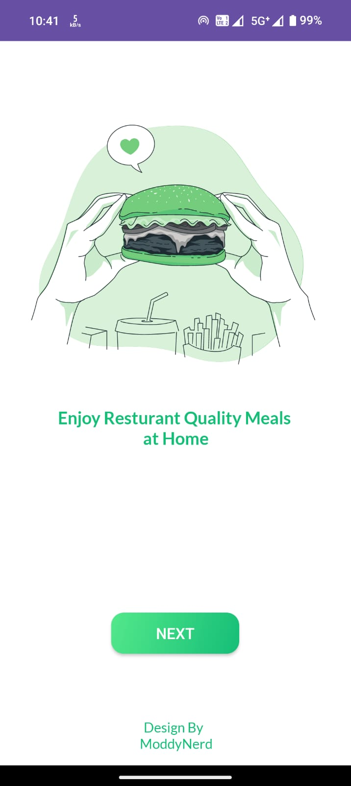
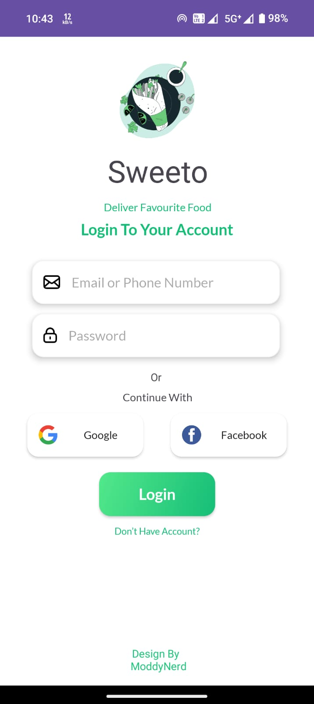
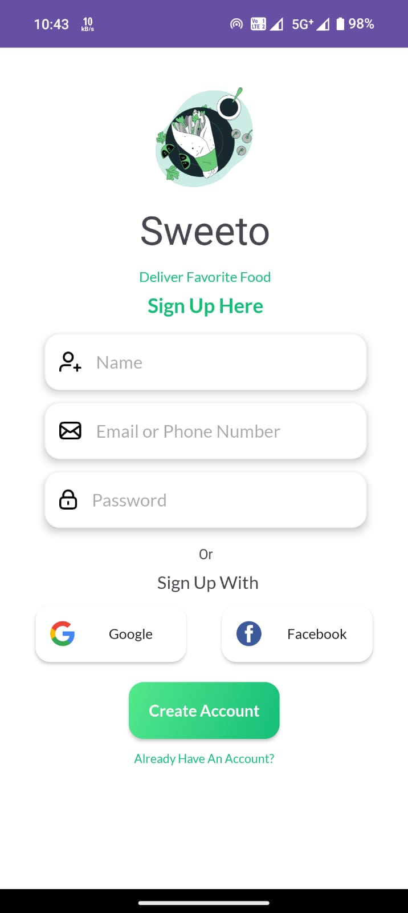
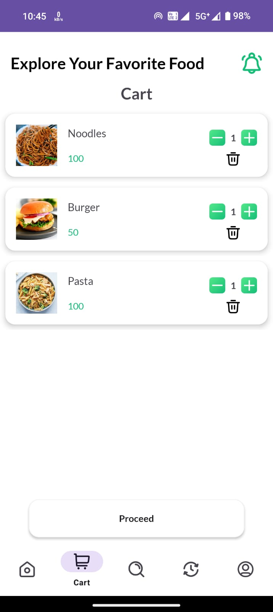
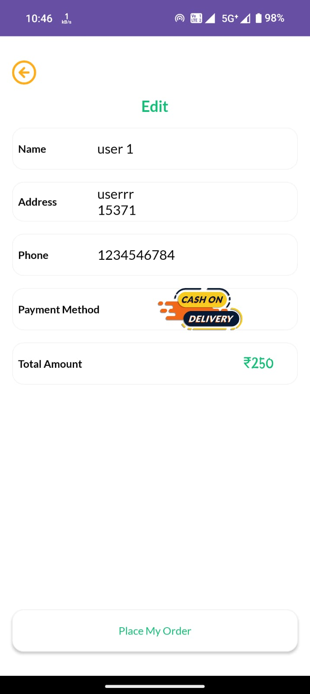
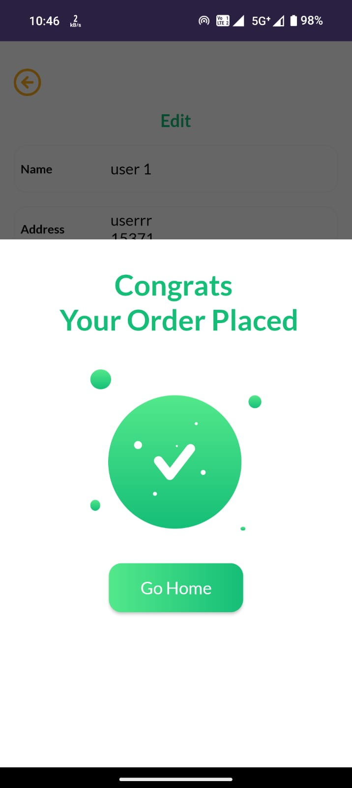
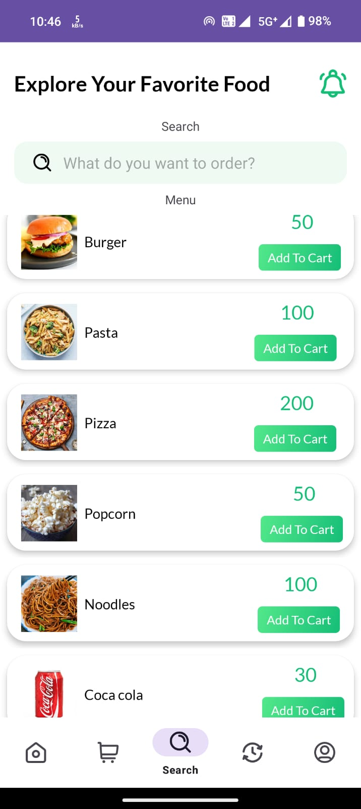
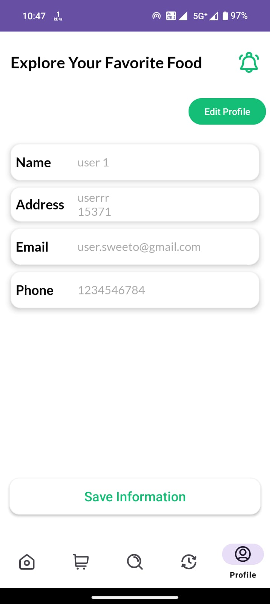

# SWEETO User App

Welcome to SWEETO User App, your ultimate solution for convenient food ordering! SWEETO offers a user-friendly platform to explore, order, and enjoy your favorite dishes hassle-free. With a range of features designed to enhance your food ordering experience, SWEETO ensures that every craving is satisfied with ease.

## Features

- Sign Up and Log In: Easily create an account or log in to begin your food journey.

- Explore the Food World: Discover a variety of restaurants and cuisines to satisfy your taste buds.

- Discover Popular Picks: Find trending and popular dishes tailored to your preferences.

- Quick Search: Quickly find your favorite dishes or restaurants with our intuitive search functionality.

- Add to Cart: Effortlessly add items to your cart with a single tap.

- Quantity Adjustment: Customize your order by adjusting quantities according to your preferences.

- Cart Management: Review, modify, or remove items from your cart before checkout.

- Seamless Checkout: Experience hassle-free checkout with secure payment options for a smooth transaction.

- Edit Order Details: Make changes to your order details anytime before finalizing your purchase.

- Order History: Keep track of your past orders for easy reference or reordering.

- Recent Purchases: Access your recent purchases conveniently for quick reordering.

- Order Status Tracking: Stay updated with real-time order status tracking from preparation to delivery.

- Profile Update: Manage your profile information and preferences effortlessly.

 ## App Demo - https://youtu.be/1nE1y6Z4zGQ
 ## APK Link - https://drive.google.com/file/d/1yTNZrnORYTt_kwNYSiWV_rDakXX70yfY/view?usp=drive_link

## Screenshots 📸

 

## Technologies Used

- Firebase: Utilized for real-time database management and authentication services.

- Kotlin: Implemented using Kotlin programming language for robust and concise codebase.

- Android SDK: Software development kit for building Android applications.

- Glide: Image loading library for Android that provides easy image loading and caching.

- Analytics: Tools like Firebase Analytics or Google Analytics for tracking user engagement and behavior within the app.

## Contributing

We welcome contributions from the community to enhance SWEETO User App further. Feel free to fork the repository, make improvements, and submit pull requests.

1. Fork the repository.
2. Create a new branch: `git checkout -b feature/awesome-feature`
3. Make changes and commit: `git commit -m 'Add awesome feature'`
4. Push to the branch: `git push origin feature/awesome-feature`
5. Open a pull request.

## License

This App is licensed under the [MIT License](https://choosealicense.com/licenses/mit/), allowing for open collaboration and innovation in the spirit of shared knowledge.

Thank you for being part of the Sweeto User App! If you have any questions or suggestions, feel free to open an issue or reach out to us. Happy coding! 🚀📞
